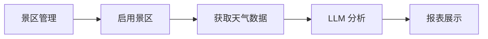

> 完整的景区天气预报系统使用指南，包括 Open-Meteo API 数据获取、LLM 智能分析、特殊景观预测（云海/日出/佛光等）、观景适宜度评级等功能，为游客提供科学的观景决策支持。

## 快速参考

### 功能模块

| 模块 | 功能 | 说明 |
|------|------|------|
| **报表展示** | 天气数据可视化 | 按日期展示午前/午后天气，提供观景建议 |
| **景区管理** | 景区 CRUD 操作 | 添加、编辑、删除景区，批量导入/导出 |
| **天气数据** | 数据获取与分析 | 从 Open-Meteo 获取数据，LLM 智能分析 |
| **提示词** | LLM 提示词管理 | 编辑、导入、导出分析提示词模板 |
| **配置** | 系统配置 | API 地址、模型参数、高亮样式配置 |

### 快速开始

```bash
# 1. 启动开发服务器
pnpm run docs:dev

# 2. 访问天气页面
http://localhost:5173/weather
```

### 核心流程



## 一、功能介绍

### 1.1 核心功能

**景区天气预报系统**是一个集成了实时天气数据获取和 AI 智能分析的综合性平台，主要功能包括：

1. **多景区管理**：支持添加、编辑、删除多个景区，可批量操作
2. **自动天气获取**：基于 Open-Meteo API 自动获取未来 7 天 hourly 天气数据
3. **LLM 智能分析**：使用大语言模型分析天气数据，生成观景建议
4. **特殊景观预测**：预测云海、日出、日落、雾凇、彩虹、佛光等特殊景观
5. **观景适宜度评级**：优/良/中/差四级评级，辅助决策

### 1.2 技术架构

```
┌─────────────────────────────────────────────────────────┐
│                    前端展示层                              │
│  ┌──────────┐ ┌──────────┐ ┌──────────┐ ┌──────────┐   │
│  │ 报表展示 │ │ 景区管理 │ │ 天气数据 │ │ 提示词   │   │
│  └──────────┘ └──────────┘ └──────────┘ └──────────┘   │
├─────────────────────────────────────────────────────────┤
│                    业务逻辑层                              │
│  ┌──────────────────┐ ┌──────────────────┐              │
│  │   Pinia Store    │ │   工具函数        │              │
│  │ - scenicStore    │ │ - weatherMapper  │              │
│  │ - weatherStore   │ │ - openMeteo Api  │              │
│  │ - promptStore    │ │                  │              │
│  │ - configStore    │ │                  │              │
│  └──────────────────┘ └──────────────────┘              │
├─────────────────────────────────────────────────────────┤
│                    数据层                                 │
│  ┌──────────────────┐ ┌──────────────────┐              │
│  │   localStorage   │ │   外部 API        │              │
│  │   (持久化存储)    │ │ - Open-Meteo     │              │
│  │                  │ │ - LLM API        │              │
│  └──────────────────┘ └──────────────────┘              │
└─────────────────────────────────────────────────────────┘
```

### 1.3 默认景区

系统预置以下知名景区：

| 景区名称 | 省份 | 城市 | 纬度 | 经度 |
|---------|------|------|------|------|
| 黄山 | 安徽省 | 黄山市 | 30.137 | 118.155 |
| 峨眉山 | 四川省 | 峨眉山市 | 29.580 | 103.450 |
| 泰山 | 山东省 | 泰安市 | 36.250 | 117.120 |
| 庐山 | 江西省 | 九江市 | 29.550 | 115.980 |
| 武功山—金顶 | 江西省 | 萍乡市 | 27.507 | 114.173 |

## 二、景区管理

### 2.1 添加景区

**步骤：**

1. 点击"景区管理"标签页
2. 点击"添加景区"按钮
3. 填写景区信息：
   - **名称**：景区名称（如"黄山"）
   - **省份**：所在省份（如"安徽省"）
   - **城市**：所在城市（如"黄山市"）
   - **纬度**：GPS 纬度（如 30.137）
   - **经度**：GPS 经度（如 118.155）
   - **海拔**：可选，单位米
4. 点击"确定"保存

**获取经纬度的方法：**
- 使用 Google 地图：右键点击位置，选择"这是什么？"，会显示经纬度
- 使用在线工具：如 [经纬度查询](https://www.gpsspg.com/)

### 2.2 编辑景区

1. 在景区列表中找到目标景区
2. 点击"编辑"按钮
3. 修改信息后点击"保存"

### 2.3 批量操作

**批量启用/禁用：**
1. 勾选多个景区
2. 点击"批量启用"或"批量禁用"按钮

**批量删除：**
1. 勾选要删除的景区
2. 点击"批量删除"按钮
3. 确认删除

**清空景区：**
- **清空自定义**：删除所有自定义添加的景区，保留预置景区
- **清空全部**：删除所有景区数据

### 2.4 导入/导出

**导出景区数据：**
1. 点击"导出景区"按钮
2. 自动下载 JSON 文件

**导入景区数据：**
1. 点击"导入景区"按钮
2. 选择以下方式之一：
   - **文件上传**：选择 JSON 文件
   - **粘贴 JSON**：直接粘贴 JSON 文本
3. 点击"导入"按钮

**JSON 格式示例：**
```json
[
  {
    "id": "1",
    "name": "黄山",
    "province": "安徽省",
    "city": "黄山市",
    "latitude": 30.137,
    "longitude": 118.155,
    "enabled": true
  }
]
```

## 三、天气数据获取

### 3.1 获取天气数据

**步骤：**

1. 点击"天气数据"标签页
2. 点击"获取启用景区天气"按钮
3. 在弹出的对话框中设置：
   - **开始日期**：选择起始日期
   - **结束日期**：选择结束日期（建议 7 天内）
   - **获取时段**：
     - 全天（上午 + 下午）
     - 仅上午（6:00-12:00）
     - 仅下午（12:00-18:00）
4. 点击"开始获取"

**进度显示：**
- 实时显示获取进度百分比
- 显示当前处理的景区名称
- 显示成功/失败数量统计

### 3.2 数据来源

天气数据来自 [Open-Meteo API](https://open-meteo.com/)，这是一个免费的气象 API，无需 API Key。

**获取的气象参数：**
- 温度（2 米高度）
- 天气代码（WMO 代码）
- 云量（%）
- 相对湿度（%）
- 能见度（km）
- 降水量（mm）

### 3.3 WMO 天气代码对照表

| 代码 | 描述 | 类别 |
|------|------|------|
| 0 | 晴朗 | sunny |
| 1 | 主要晴朗 | sunny |
| 2 | 多云 | cloudy |
| 3 | 阴天 | cloudy |
| 45, 48 | 雾 | foggy |
| 51-57 | 毛毛雨 | rainy |
| 61-67 | 雨 | rainy |
| 71-77 | 雪 | snowy |
| 80-86 | 阵雨/阵雪 | rainy |
| 95-99 | 雷暴 | stormy |

### 3.4 导出数据

**步骤：**
1. 点击"导出数据"按钮
2. 自动下载 JSON 文件

**导出的数据格式：**
```json
{
  "downloadTime": 1719216000000,
  "dateRange": {
    "start": "2026-06-24",
    "end": "2026-06-30"
  },
  "data": [
    {
      "scenicId": "1",
      "date": "2026-06-24",
      "morning": {
        "temperature": 22,
        "weatherCode": 0,
        "weatherDesc": "晴",
        "cloudCover": 15,
        "humidity": 55
      },
      "afternoon": {
        "temperature": 28,
        "weatherCode": 2,
        "weatherDesc": "多云",
        "cloudCover": 40,
        "humidity": 45
      }
    }
  ]
}
```

### 3.5 导入数据

**步骤：**
1. 点击"导入数据"按钮
2. 粘贴 JSON 数据
3. 点击"导入"

## 四、LLM 智能分析

### 4.1 配置 LLM

**步骤：**

1. 点击"配置"标签页
2. 在"LLM 配置"部分设置：
   - **API 地址**：如 `http://localhost:8080` 或 `https://api.openai.com`
   - **模型名称**：如 `gpt-3.5-turbo`、`qwen2.5-7b`
   - **API Key**：可选，根据 API 提供商要求
   - **超时时间**：默认 120000ms（2 分钟）

### 4.2 执行分析

**步骤：**

1. 确保已获取天气数据
2. 点击"LLM 天气分析"按钮
3. 在弹出的对话框中设置：
   - **分析景区**：选择要分析的景区（可多选，留空则分析全部）
   - **日期范围**：选择要分析的日期范围
   - **分析时段**：全天/仅上午/仅下午
4. 点击"开始分析"

**进度显示：**
- 实时显示分析进度
- 显示当前分析的景区和日期

### 4.3 分析结果

LLM 分析后会更新以下字段：

| 字段 | 说明 | 可能值 |
|------|------|--------|
| **suitability** | 观景适宜度 | 优、良、中、差 |
| **isSpecial** | 是否特殊天气 | true/false |
| **specialType** | 特殊景观类型 | 云海/日出/日落/雾凇/彩虹/佛光 |

### 4.4 特殊景观判断规则

| 景观 | 判断条件 |
|------|----------|
| **云海** | 云量 30-70% + 湿度>60% |
| **日出** | 晴朗（代码 0-1）+ 云量<30% + 上午时段 |
| **日落** | 晴朗（代码 0-1）+ 云量<30% + 下午时段 |
| **雾凇** | 温度≤0°C + 湿度>80% + 有雾 |
| **彩虹** | 雨后转晴 |
| **佛光** | 云量 50-90% + 湿度>70% + 晴朗 |

### 4.5 提示词管理

**编辑提示词：**
1. 点击"提示词"标签页
2. 点击要编辑的提示词的"编辑"按钮
3. 修改提示词内容
4. 点击"保存"

**提示词占位符：**
- `{scenicName}` - 景区名称
- `{date}` - 日期
- `{amTemp}` - 上午温度
- `{amCode}` - 上午天气代码
- `{amCloud}` - 上午云量
- `{amHumidity}` - 上午湿度
- `{pmTemp}`、`{pmCode}` 等 - 下午数据

**导出/导入提示词：**
- 点击"导出提示词"下载 JSON 文件
- 点击"导入提示词"粘贴 JSON 数据

**重置提示词：**
- 点击"重置"恢复单个提示词为默认值
- 点击"重置所有提示词"恢复全部

## 五、报表展示

### 5.1 查看天气报表

**步骤：**

1. 点击"报表展示"标签页
2. 选择景区
3. 选择日期范围
4. 点击"刷新"按钮

### 5.2 报表内容

报表展示以下内容：

**午前天气（6:00-12:00）：**
- 天气状况（带 emoji 图标）
- 温度（°C）
- 湿度（%）
- 云量（%）

**午后天气（12:00-18:00）：**
- 同午前

**观景建议：**
- 推荐时段标签（推荐上午/推荐下午）
- 具体建议文字

### 5.3 特殊景观高亮

当检测到特殊景观时，天气单元格会高亮显示：

| 景观 | 高亮颜色 | 图标 |
|------|----------|------|
| 云海 | 金色渐变 | 🌟 |
| 日出 | 橙红色渐变 | 🌅 |
| 日落 | 橙色渐变 | 🌇 |
| 雾凇 | 浅蓝色渐变 | ❄️ |
| 彩虹 | 粉色渐变 | 🌈 |
| 佛光 | 金色发光 | ✨ |

### 5.4 观景适宜度标签

| 等级 | 颜色 | 说明 |
|------|------|------|
| **优** | 绿色 | 天气代码 0-2，无降水 |
| **良** | 蓝色 | 天气代码 2-3，多云/阴 |
| **中** | 黄色 | 天气代码 45-57，雾/毛毛雨 |
| **差** | 红色 | 天气代码 61+，雨/雪/雷暴 |

### 5.5 观景建议算法

**评分规则：**

1. **云量评分**（满分 30 分）
   - 20-40%：+30 分（最佳）
   - <20% 或 40-60%：+15 分

2. **湿度评分**（满分 20 分）
   - 40-60%：+20 分（最佳）
   - <40% 或 60-70%：+10 分

3. **适宜度评分**（满分 30 分）
   - 优：+30 分
   - 良：+20 分
   - 中：+10 分

**推荐时段：**
- 上午分数高 → 推荐上午
- 下午分数高 → 推荐下午
- 分数相同 → 全天适宜

## 六、常见问题

### Q1: 获取天气数据失败？

**A:** 检查以下几点：
1. 确认景区已启用
2. 确认景区经纬度正确
3. 检查网络连接
4. Open-Meteo API 可能偶尔不稳定，稍后重试

### Q2: LLM 分析没有返回结果？

**A:** 检查：
1. LLM API 地址是否正确
2. 是否需要 API Key
3. 模型名称是否正确
4. 查看浏览器控制台（F12）的错误信息

### Q3: 如何添加更多景区？

**A:** 
1. 在"景区管理"中手动添加
2. 或使用批量导入功能导入 JSON 文件

### Q4: 数据保存在哪里？

**A:** 所有数据保存在浏览器的 localStorage 中：
- 景区数据：`scenic-weather-scenics`
- 天气数据：`scenic-weather-data`
- 提示词：`scenic-weather-prompts`
- 配置：`scenic-weather-config`

**注意：** 清除浏览器缓存会丢失数据，建议定期导出备份。

### Q5: 如何清空所有数据？

**A:** 
1. 打开浏览器开发者工具（F12）
2. 进入 Application/存储 标签
3. 找到 localStorage
4. 删除所有 `scenic-weather-*` 开头的键

### Q6: 支持的日期范围是多久？

**A:** Open-Meteo 提供过去 1 年和未来 15 天的数据，建议获取未来 7 天内的数据以保证准确性。

### Q7: 可以离线使用吗？

**A:** 
- 查看已获取的数据：可以离线
- 获取新天气数据：需要联网
- LLM 分析：需要联网访问 LLM API

## 七、总结

### 核心功能

1. **景区管理**：支持 CRUD 和批量操作
2. **天气获取**：基于 Open-Meteo API 自动获取
3. **LLM 分析**：智能生成观景建议和特殊景观预测
4. **报表展示**：直观展示天气数据和观景适宜度

### 使用流程

```
1. 景区管理 → 添加/启用景区
2. 天气数据 → 获取启用景区天气
3. 天气数据 → LLM 天气分析
4. 报表展示 → 查看分析结果
```

### 技术特点

- **Vue 3 + TypeScript**：类型安全的组件开发
- **Pinia**：状态管理，支持持久化
- **Element Plus**：UI 组件库
- **Open-Meteo**：免费天气 API
- **LLM**：智能分析天气数据

### 参考资源

- [Open-Meteo API 文档](https://open-meteo.com/en/docs)
- [WMO 天气代码](https://community.open-meteo.com/t/weather-condition-codes-wmo-code/436)
- [Element Plus 文档](https://element-plus.org/)
- [Pinia 文档](https://pinia.vuejs.org/)

---

景区天气预报系统为游客提供科学的观景决策支持，帮助捕捉最佳观景时机和特殊自然景观。
